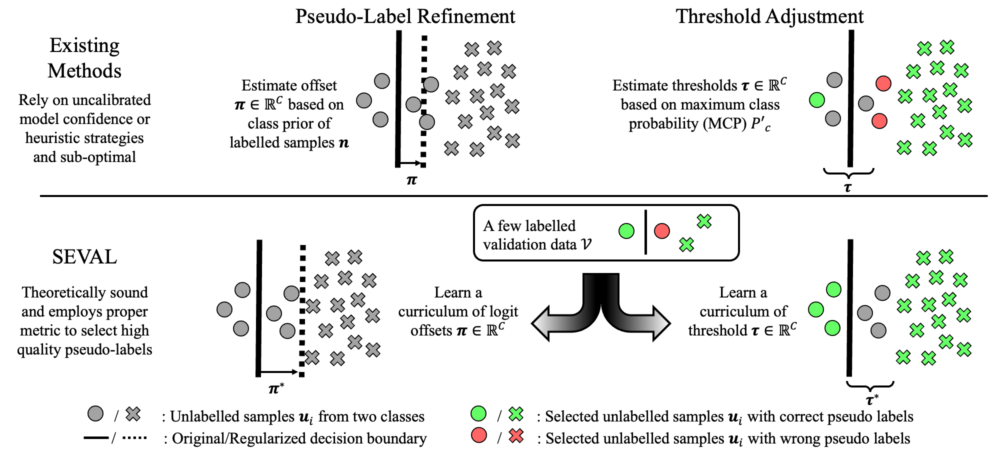

# SEVAL

## Introduction

We find that current SSL algorithms struggle to perform well when exposed to imbalanced training data because the generated pseudo-labels tend to be biased toward the majority class. We closely examine pseudo-labeling for imbalanced SSL through the lens of statistical analysis and find that existing SSL algorithms, which generate pseudo-labels using heuristic strategies or uncalibrated model confidence, are unreliable. 

To address this, we propose learning refinement and thresholding parameters from a holdout dataset in a class-balanced manner. Our pseudo-labeling strategies are theoretically superior to their counterparts, and our experiments show that SEVAL surpasses state-of-the-art SSL methods, delivering more accurate and effective pseudo-labels in various imbalanced SSL situations.

<br/> <div align=center></div>

## Installation

For Conda users, you can create a new Conda environment using

```
conda create -n seval python=3.7
```

after activating the environment with 
```
source activate seval
```
try to install all the dependencies with

```
pip install -r requirements.txt
```
also install the conda environment for the jupyter notebook kernel.

```
python -m ipykernel install --user --name=seval
```

## Training on CIFAR10-LT, CIFAR100-LT, and STL10-LT

Please use corresponding configuration files and select the appropriate hyper-parameters for varying experiment settings, as summarized in our paper. The datasets will be downloaded once the related code is excuted.

For example, running a standard FixMatch on CIFAR-10-LT:
```
python main.py --config-file configs/cifar10/fixmatch.yaml \
                DATASET.CIFAR10.NUM_LABELED_HEAD 500 \
                DATASET.CIFAR10.NUM_UNLABELED_HEAD 4000 \
                SEED 79 GPU_ID 0
```

Runing SEVAL with the same setting:

Firstly, estimate $\pi$ and $\tau$:
```
python main.py --config-file configs/cifar10/fixmatch_seval_estim.yaml \
                DATASET.CIFAR10.NUM_LABELED_HEAD 500 \
                DATASET.CIFAR10.NUM_UNLABELED_HEAD 4000 \
                SEED 79 GPU_ID 0
```
Then, standard training process following (which load the parameter learned):
```
python main.py --config-file configs/cifar10/fixmatch_seval_load.yaml \
                DATASET.CIFAR10.NUM_LABELED_HEAD 500 \
                DATASET.CIFAR10.NUM_UNLABELED_HEAD 4000 \
                SEED 79 GPU_ID 0
```

Or directly utilize additional validation data:
```
python main.py --config-file configs/cifar10/fixmatch_seval.yaml \
                DATASET.CIFAR10.NUM_LABELED_HEAD 500 \
                DATASET.CIFAR10.NUM_UNLABELED_HEAD 4000 \
                SEED 79 GPU_ID 0
```


## Preparation for Semi-Aves

Download [data](https://github.com/cvl-umass/semi-inat-2020#data-and-annotations) and [label](https://github.com/cvl-umass/ssl-evaluation/tree/main/data/semi_aves), and place them in the following format.

```
├── data
│   ├── semi_fgvc
│   │   ├── trainval_images
│   │   ├── test
│   │   ├── u_train_in
│   │   ├── u_train_out
│   │   ├── l_train_val.txt
│   │   ├── u_train_in.txt
│   │   ├── u_train.txt
│   │   └── test.txt
```

## Preparation for ImageNet-127

Download [data](https://image-net.org/download-images.php) (32x32), and place them in the following format.

```
├── data
│   ├── imagenet
│   │   ├── train_data_batch_1
│   │   ├── train_data_batch_2
│   │   ├── ...
│   │   └── val_data
```

```
cd data/imagenet/
python construct_small_imagenet_127.py
```

## Acknowledgement

This code borrows from [DASO](https://github.com/ytaek-oh/daso).

## Citation

If you find our work beneficial for your projects, please kindly consider citing it:

```
@article{li2024semi,
  title={Learning Label Refinement and Threshold Adjustment for Imbalanced Semi-Supervised Learning},
  author={Li, Zeju and Zheng, Ying-Qiu and Chen, Chen and Jbabdi, Saad},
  year={2024}
}
```